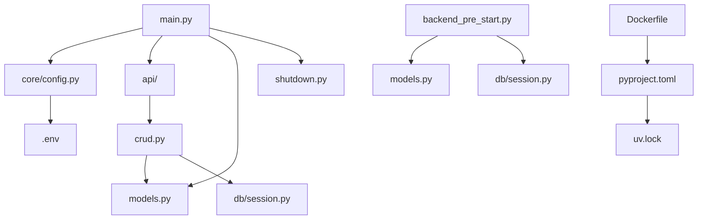

# Project Directory Structure

```shell
fastapi-golden-template/
├── .github/                   # GitHub configuration
│   ├── dependabot.yml         # Automated dependency updates
│   └── workflows/             # CI/CD pipelines
│       └── build.yaml         # Main build/test/deploy workflow
├── .gitignore                 # Files to exclude from version control
├── .pre-commit-config.yaml    # Code quality automation
├── README.md                  # Project overview and quickstart
├── docker/                    # Docker configuration
│   ├── Dockerfile             # Production container definition
│   ├── docker-compose.override.yml # Local development overrides
│   └── docker-compose.yml     # Main app and service definitions
├── docs/                      # Project documentation
└── src/                       # Application source code
    ├── .dockerignore          # Docker build exclusions
    ├── .env.template          # Environment variable template
    ├── .gitignore             # Source-specific ignores
    ├── app/                   # Core application module
    │   ├── api/               # Routers
    │   │   ├── deps.py        # Common dependencies (e.g., get_db, auth)
    │   │   ├── main.py        # Router assembly
    │   │   ├── v1/            # Versioned API
    │   │   │   ├── __init__.py 
    │   │   │   └── users.py   # Router for users
    │   ├── core/              # Application core
    │   │   ├── config.py      # Loading and validating environment variables
    │   │   ├── security.py    # JWT, OAuth, etc.
    │   │   └── logging.py     # Logging configuration
    │   ├── db/ 
    │   │   ├── base.py        # Basic SQLAlchemy models (Base = declarative_base())
    │   │   ├── session.py     # Session creation (get_db)
    │   │   └── migrations/    # Alembic migrations
    │   ├── models/            # SQLAlchemy models (ORM)
    │   │   ├── __init__.py
    │   │   └── user.py
    │   ├── repositories/      # Database queries
    │   │   ├── __init__.py
    │   │   └── user_repository.py
    │   ├── schemas/           # Pydantic Schemas (DTO)
    │   │   ├── __init__.py
    │   │   └── user.py
    │   ├── services/          # Business logic (use cases)
    │   │   ├── __init__.py
    │   │   └── user_service.py
    │   ├── __init__.py        # Package initialization
    │   ├── alembic/           # Database migration scripts
    │   ├── backend_pre_start.py # Pre-launch checks
    │   ├── main.py            # Application entry point
    │   ├── dependencies.py    # Global dependencies (auth, DB, etc.)
    │   ├── shutdown.py        # Graceful termination handlers
    │   ├── tests/             # Test suite
    ├── pyproject.toml         # Dependency and tool configuration
    └── uv.lock                # Lock file for reproducible installs
```

## Detailed Breakdown

### 1. GitHub Configuration (`.github/`)
| File/Directory         | Purpose                                           |
|------------------------|---------------------------------------------------|
| `dependabot.yml`       | Automated dependency updates configuration        |
| `workflows/build.yaml` | CI/CD pipeline for tests, builds, and deployments |

### 2. Root Configuration Files
| File                      | Purpose                                                |
|---------------------------|--------------------------------------------------------|
| `.gitignore`              | Global ignore patterns for Git                         |
| `.pre-commit-config.yaml` | Automated code quality checks before commits           |
| `README.md`               | Project overview, setup instructions, and feature list |

### 3. Docker Configuration (`docker/`)
| File                          | Purpose                                 |
|-------------------------------|-----------------------------------------|
| `Dockerfile`                  | Production container build instructions |
| `docker-compose.yml`          | Defines app                             |
| `docker-compose.override.yml` | Local development customizations        |

### 4. Documentation (`docs/`)

A detailed documentation for specific topics.

### 5. Source Code (`src/`)
| File/Directory   | Purpose                                        |
|------------------|------------------------------------------------|
| `.dockerignore`  | Files excluded from Docker builds              |
| `.env.template`  | Environment variable template (copy to .env)   |
| `.gitignore`     | Source-specific ignore patterns                |
| `pyproject.toml` | Dependency management and tool configuration   |
| `uv.lock`        | Lock file for reproducible dependency installs |

### 6. Application Module (`src/app/`)
| File/Directory         | Purpose                                                                                                                                    |
|------------------------|--------------------------------------------------------------------------------------------------------------------------------------------|
| `__init__.py`          | Package initialization                                                                                                                     |
| `alembic/`             | Database migration scripts and versions                                                                                                    |
| `api/`                 | API routers and endpoint implementations                                                                                                   |
| `backend_pre_start.py` | Pre-launch checks (DB connection, etc.)                                                                                                    |
| `core/`                | Application core components:<br>- `config.py`: Settings management<br>- `logging.py`: Log configuration<br>- `security.py`: Auth utilities |
| `crud.py`              | Database operations pattern implementations                                                                                                |
| `initial_data.py`      | Database seeding for initial setup                                                                                                         |
| `main.py`              | FastAPI application initialization                                                                                                         |
| `models.py`            | SQLModel database model definitions                                                                                                        |
| `shutdown.py`          | Graceful termination handlers                                                                                                              |
| `tests/`               | Test suite with pytest:<br>- `test_api.py`: Endpoint tests<br>- `test_models.py`: Model tests                                              |
| `utils.py`             | Helper functions and utilities                                                                                                             |

## Key File Relationships



## Why This Structure?

1. **Separation of Concerns**:
    - DevOps config in `.github/` and `docker/`
    - Docs in `docs/`
    - App code isolated in `src/app/`

2. **Reproducibility**:
    - `uv.lock` ensures consistent dependencies
    - Dockerfiles provide identical environments

3. **Scalability**:
    - Modular design allows adding new components
    - Clear paths for new features:
        - `app/api/v2/` for API versioning
        - `app/services/` for business logic

4. **Security**:
    - Sensitive files excluded via .gitignore
    - Secret management through .env files
    - Pre-commit hooks prevent credential leaks

5. **Maintainability**:
    - Documentation co-located with code
    - Standardized layout across projects
    - Clear separation of test/prod code
