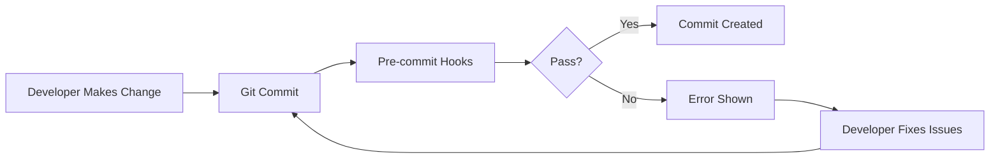

# Pre commit hooks

This repository uses pre-commit hooks to ensure code quality and consistency. The hooks are defined in the `.pre-commit-config.yaml` file.


## Install

### Please install pre-commits before working in this repository
```shell
pip install --upgrade pre-commit
pre-commit install --install-hooks
```

### Auto update all pre-hooks
```shell
pre-commit autoupdate
```

### Run pre-commit hooks on all files
```shell
pre-commit run --all-files
```

By default, the pre-commit hooks will run on all files. If you want to run the hooks on specific files, you can do so by specifying the file names as arguments to the `pre-commit run` command.

## Key Hooks Explained

### 1. Security Hooks
| Hook                      | Protection                                |
|---------------------------|-------------------------------------------|
| `detect-private-key`      | Blocks SSH keys, API tokens, credentials  |
| `no-commit-to-branch`     | Prevents commits to main/develop branches |
| `check-added-large-files` | Stops accidental binary/file commits      |

### 2. Code Quality Hooks
| Hook                     | Function                         |
|--------------------------|----------------------------------|
| `black`                  | Consistent Python formatting     |
| `ruff`                   | Advanced linting and auto-fixing |
| `reorder-python-imports` | Standardized import structure    |
| `trailing-whitespace`    | Clean whitespace management      |

### 3. Validation Hooks
| Hook                   | Checks                              |
|------------------------|-------------------------------------|
| `check-json`           | Validates JSON syntax               |
| `check-yaml`           | Validates YAML syntax               |
| `check-merge-conflict` | Detects unresolved merge markers    |
| `check-case-conflict`  | Prevents case-sensitive file issues |

## Best Practices

1. **Run Locally First**: Always test hooks before pushing
2. **Update Regularly**: Run `pre-commit autoupdate` monthly
3. **CI Enforcement**: Require pre-commit checks in PRs
4. **Team Alignment**: Share config across all projects
5. **Selective Checks**: Use `files: \.py$` for language-specific hooks



## Why This Configuration?

1. **Balanced Strictness**: Catches critical issues without being obstructive
2. **Performance Focus**: Uses Ruff for faster linting
3. **Security First**: Blocks credentials and large files
4. **Modern Python**: Enforces latest formatting standards
5. **Auto-Fix Priority**: Automatically corrects fixable issues

> "Pre-commit catches 85% of common errors before code review, saving our team 10+ hours weekly."<br>
> - Senior Engineer, AuraxCapital
